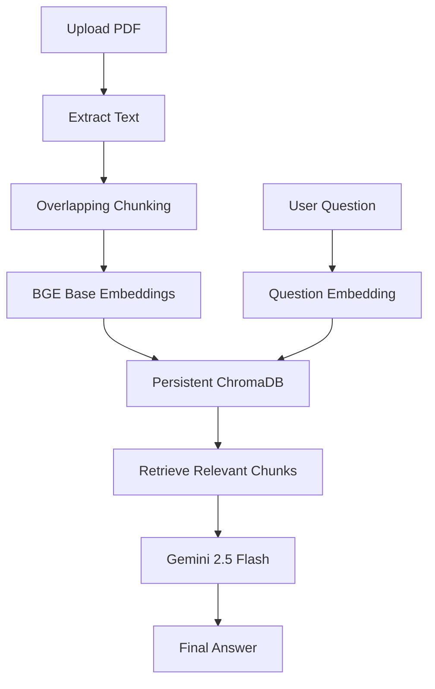
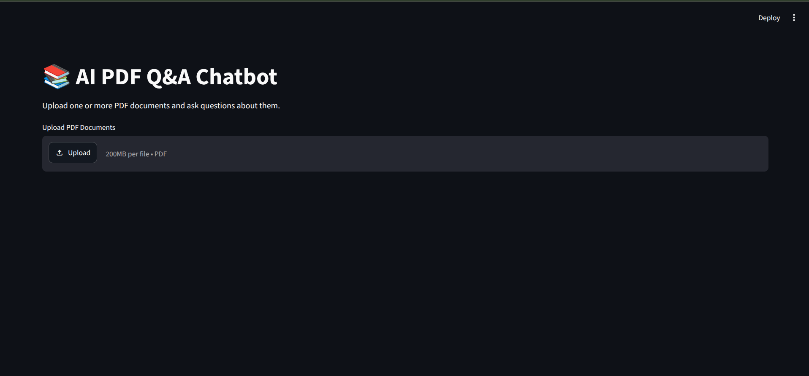
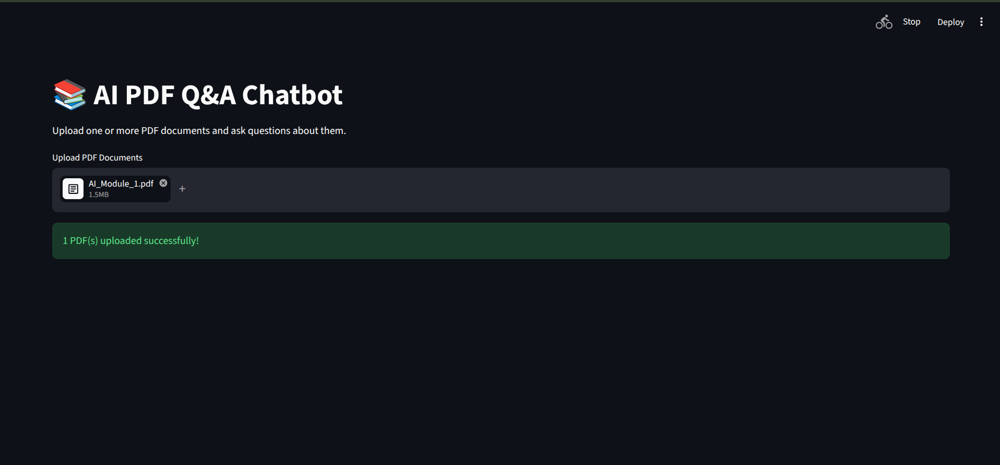
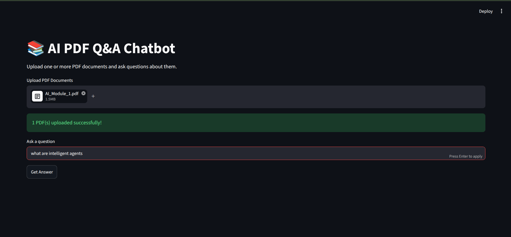
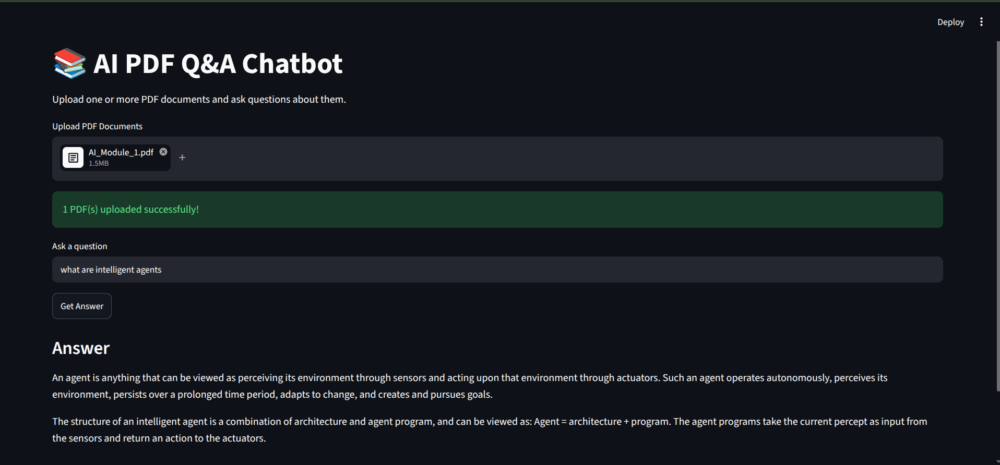
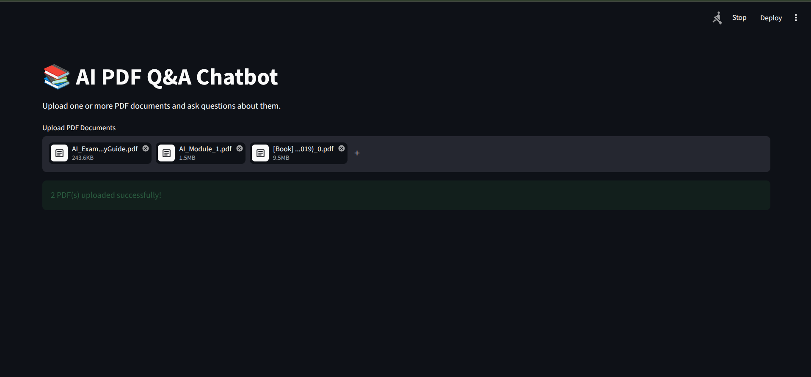

# 📚 AI PDF Q&A Chatbot (RAG)


A **Retrieval-Augmented Generation (RAG)** application that enables users to upload one or more PDF documents and ask natural language questions grounded entirely in the uploaded content.

Built with **Python**, **ChromaDB**, **BAAI/bge-base-en-v1.5**, **Google Gemini 2.5 Flash**, and **Streamlit**.

---

## 🚀 Live Demo

**Hugging Face Space**

👉 https://huggingface.co/spaces/khanmurtaza/rag-academic-assistant

---

# ✨ Features

- 📄 Multiple PDF upload
- 📑 PDF text extraction
- ✂️ Overlapping text chunking
- 🧠 Semantic embeddings using **BAAI/bge-base-en-v1.5**
- 🗄️ Persistent **ChromaDB** vector database
- 🔍 Semantic similarity search
- 🤖 Google Gemini 2.5 Flash answer generation
- 💬 Natural language question answering
- 🌐 Streamlit web interface
- 🧩 Modular project architecture
- ☁️ Hugging Face Spaces deployment

---

# 🚀 Key Improvements

| Improvement | Description |
|------------|-------------|
| Embedding Model | Upgraded to **BAAI/bge-base-en-v1.5** |
| Chunking | Implemented overlapping chunking |
| Vector Database | Replaced FAISS with Persistent ChromaDB |
| Retrieval | Improved semantic retrieval |
| Deployment | Streamlit + Hugging Face Spaces |

---

# 🛠️ Technology Stack

- Python
- Streamlit
- ChromaDB
- Google Gemini 2.5 Flash
- Sentence Transformers
- BAAI/bge-base-en-v1.5
- PyPDF
- NumPy
- Torch
- Transformers
- python-dotenv
- Docker
- Git
- GitHub
- Hugging Face Spaces

---

# 🧠 RAG Pipeline



---

# 📂 Project Structure

```text
rag-academic-assistant/
│
├── app.py
├── rag_chat.py
├── Dockerfile
├── requirements.txt
├── README.md
├── LICENSE
├── .gitignore
│
├── src/
│   ├── pdf_loader.py
│   ├── chunker.py
│   └── vector_store.py
│
├── screenshots/
│
└── test_*.py
```

---

# ⚙️ Installation

```bash
git clone https://github.com/khanmurtaza9484/rag-academic-assistant.git
cd rag-academic-assistant

python -m venv venv

# Linux / macOS
source venv/bin/activate

# Windows
venv\Scripts\activate

pip install -r requirements.txt
```

Create a `.env` file:

```text
GEMINI_API_KEY=YOUR_API_KEY
```

Run the application:

```bash
streamlit run app.py
```

---

# ⚡ How It Works

1. Upload one or more PDF documents.
2. Extract text from each PDF.
3. Split the text into overlapping chunks.
4. Generate embeddings using **BAAI/bge-base-en-v1.5**.
5. Store embeddings in **Persistent ChromaDB**.
6. Convert the user question into an embedding.
7. Retrieve the most relevant chunks.
8. Pass the retrieved context to **Google Gemini 2.5 Flash**.
9. Generate the final answer.

---

# 📸 Screenshots

## Home Page



## Upload PDFs



## Ask Questions



## Generated Answer



## Multiple PDF Support



---

# 🔮 Future Improvements

- Semantic chunking
- Hybrid retrieval (BM25 + Dense Retrieval)
- Cross-encoder reranking
- OCR support for scanned PDFs
- Conversation history
- Source citations with page numbers
- Improved UI/UX
- Authentication

---

# 👨‍💻 Author

**Mohammad Murtaza Khan**

GitHub: https://github.com/khanmurtaza9484

---

# ⭐ Support

If you found this project useful, consider giving it a ⭐ on GitHub.

---

# 📄 License

This project is licensed under the **MIT License**.